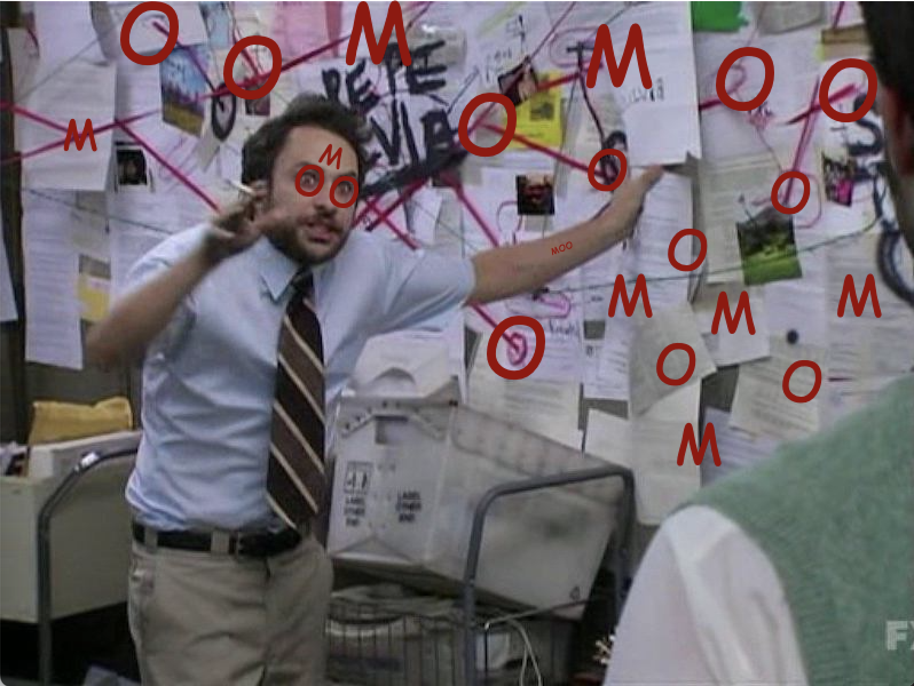
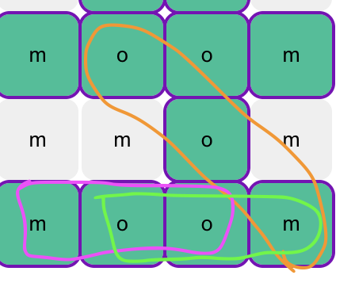
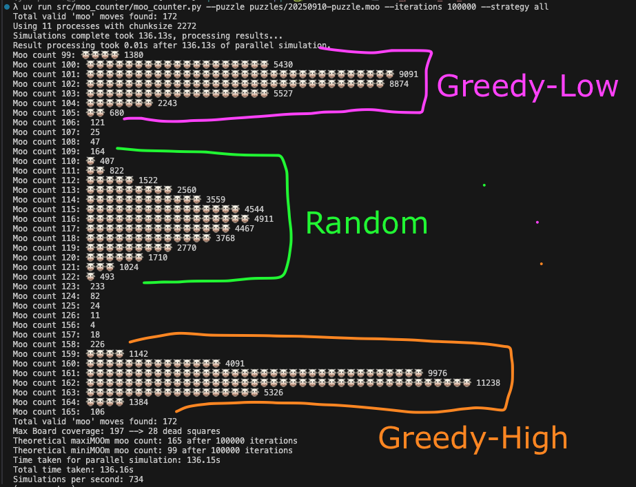

# Moo Counter 🐮

🐮 <a href="https://joshpeak.net/moo-counter/">Moo Mate Statistics Site</a> 🐮
<a href="https://joshpeak.net/moo-counter/graph.html">Moo Mate Graph Visualisation</a> 🐮

## Overview

Simulation counter of possible moos achievable in <https://find-a-moo.kleeut.com/>

What started as a fun 15x15 find-a-word where the only word is `moo` turned into a fun computer science problem.

How?

## Scoring rules

1. You select three squares to spell the word `moo`
2. These squares are then highlighted as "Covered" and you gain 1 Moo Point
3. Each subsequent `moove` only gains a point **IF** 1 of the squares selected is **NOT** already covered.
4. If you select three letters that spell `moo` and they are already covered, that scores 0 extra points and can be considered a dead `moove` at this point in the game.

**Example**

In the diagram above:

1. Purple, Orange, Green -> Scores only 2 points.
2. Purple, Green, Orange -> Scores 3 points.
3. Green, Orange, Purple -> Also 3 points.

As you can see, the **order matters**.

There are more valid `mooves` than `achievable points`.

## The Computer Science Problem

Turns out this is both a:

1. [Set Cover Problem](https://en.wikipedia.org/wiki/Set_cover_problem) and a
2. [Bin Packing Problem](https://en.wikipedia.org/wiki/Bin_packing_problem)

Where:

- You have a finite resource: the squares that get consumed with each move.

- You want to find the sequence of mooves that maximise your score and minimise your coverage consumption.

## Goal

I wanted to simulate for a given puzzle:

- What is the theoretical maximum?
- What is the median?

So I run 10k-100k simulations with different algorithmic strategies for generating the optimal sequence.

- Random shuffle
- Greedy (Both finding highest and lowest)
- [Monte Carlo Tree Search (MCTS)](https://en.wikipedia.org/wiki/Monte_Carlo_tree_search)

